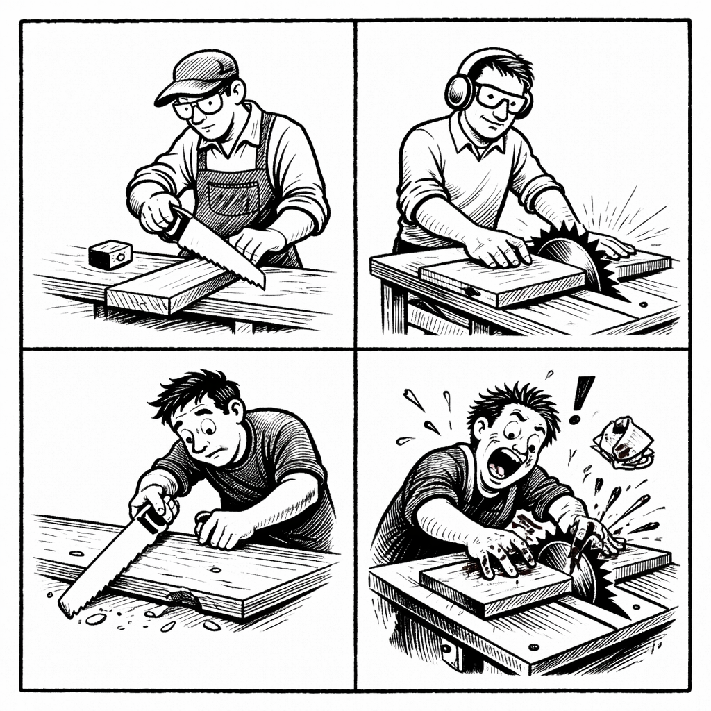

A table saw doesn’t make you a better carpenter.
It makes you faster - for better or worse.

LLMs and agents work the same way.
They’re power tools. Skill and judgment determine whether you build more, or lose fingers faster.

