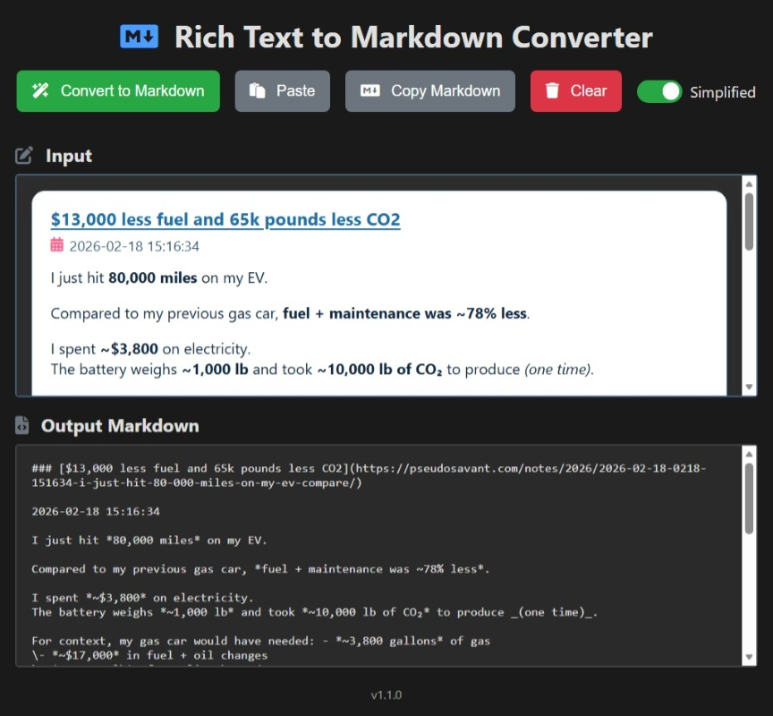

One thing I find myself doing a lot when working with LLMs and agents is copy context from other places into text. The problem is that information gets lost if the text has any meaningful formatting to it (tables, lists, links, etc).

I vibe coded a tool I use constantly: it converts your clibpoard into Markdown that it copies back into the clibpard. Give it a try! https://pseudosavant.github.io/ps-web-tools/to-markdown/

