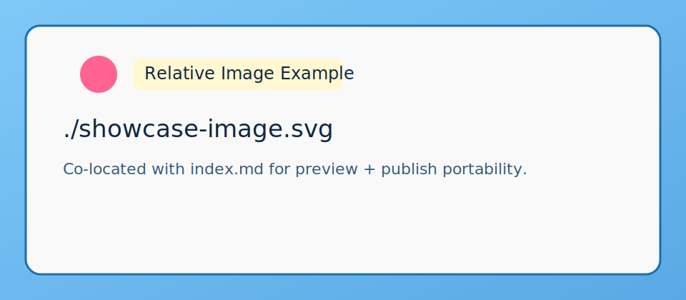

This note demonstrates common formatting patterns for quick copy/paste authoring.

## Text styles

- **Bold text**
- *Italic text*
- <u>Underlined text (via raw HTML)</u>
- ~~Strikethrough style~~ (works because raw HTML is allowed: <del>old text</del>)
- Combined: ***bold + italic***

Inline code looks like this: `uv run build.py --watch`

## Links

- External: [pseudosavant.com](https://pseudosavant.com)
- Internal relative permalink: [Hello Relative Notes](../2026-02-13-hello-relative/)

## Lists

Unordered:

- First item
- Second item
- Third item

Ordered:

1. First step
2. Second step
3. Third step

## Image

Markdown image with relative path:



Raw HTML image with explicit size:


## Code blocks

```python
from datetime import date

def publish_message(text: str) -> str:
    return f"{date.today().isoformat()} :: {text}"

print(publish_message("Hello notes"))
```

```bash
uv run tweet.py "Tiny status update from terminal."
```

## Quote and divider

> Keep writing. Keep shipping.

---

## Raw HTML embed

<div class="embed-frame">
  <strong>Custom Embed Block</strong><br>
  This is a safe place for iframe or embed snippets in your notes.
</div>

<iframe
  src="https://www.youtube-nocookie.com/embed/dQw4w9WgXcQ"
  title="Example video embed"
  loading="lazy"
  style="width:100%;max-width:560px;aspect-ratio:16/9;border:1px solid #b9daf2;border-radius:8px;"
></iframe>

## Escaped characters

Use backslashes when you want literal markdown symbols:

- `\*literal asterisk\*` -> \*literal asterisk\*
- `\_literal underscore\_` -> \_literal underscore\_
- `\# not a heading` -> \# not a heading

## Long wrapping behavior

Long URL:

https://example.com/this/is/a/very/long/path/that/keeps/going/and/going/until/it/forces/wrapping/in/narrow/mobile/viewports?with=query&and=more&tracking=parameters

Long unbroken token:

supercalifragilisticexpialidocious_and_even_longer_tokens_can_happen_in_logs_or_hashes_0123456789abcdef0123456789abcdef

## Mixed markdown + HTML in one paragraph

This paragraph has **bold markdown**, an inline <mark>HTML highlight</mark>, and a link to [GitHub](https://github.com/) in the same sentence.

## Nested lists

1. Parent ordered item
   - Child unordered item A
   - Child unordered item B
2. Another parent ordered item
   1. Child ordered sub-item 1
   2. Child ordered sub-item 2
