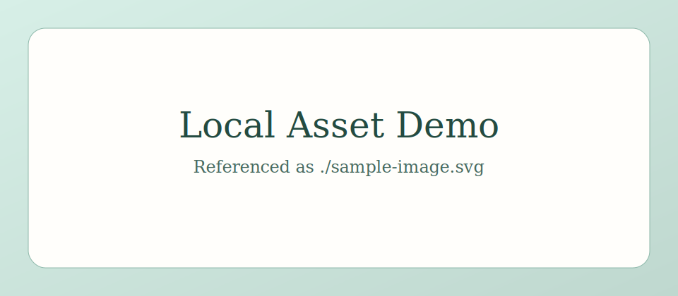

This is a sample note. Assets stay in the same folder as `index.md`, and links like `./sample-image.svg` remain portable.



Raw HTML embeds are allowed:

<div class="embed-frame">
  <strong>Embedded HTML block</strong><br>
  This came directly from Markdown without sanitizing away raw HTML.
</div>

```python
def hello() -> str:
    return "Minimal notes generator"
```
